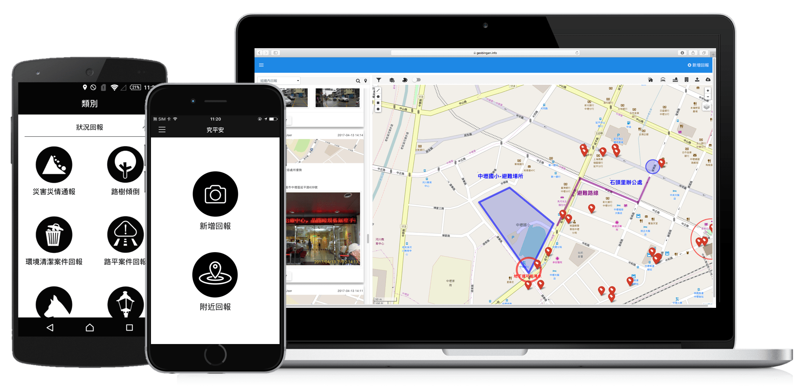

# 歡迎使用究平安

### 關於究平安

究平安 \(geoBingAn\) 是究心公益科技 \(GeoThings Inc.\) 基於群眾外包 \(crowdsourcing\) 連接政府與前線志工的災害資訊整合及協調平台。可以提供救災組織對內及時聯絡與回報，不論是民間救災團體或是公部門救災單位，若是能夠更即時蒐集災情，就可以更準確的依據這些災害資訊做出快速的反應。  
  
究平安不僅作為許多政府組織以及災害救援團體成員內部溝通訊息的平台，一般民眾亦可以藉此軟體，在重大災難發生時，取得聯繫會報與政府相關部門發布的即時訊息。 並且可透過究平安 \(geoBingAn\) App 的回報功能即時回報災情，回報的訊息均可以在[究平安網站 \(https://beta.geobingan.info\)](https://beta.geobingan.info) 上檢視。究心科技的救災資訊協調平台-究平安，整合公私部門組織與志工/職工的回報與需求，讓救災資訊可以更為同步，也讓救災資源能被有效的運用。

究平安一名取自於台語發音，期望藉由這個 App 在防救災領域上貢獻一份心力。究平安是 App 與網路服務平台，目前與地方政府合作，利用智慧型手機創造出更美好的明天。遇到問題時，民眾可以利用智慧型手機，開啟 GPS 定位，使用究平安 App 回報給地方政府。就平安不僅僅是一個群眾外包的回報工具，更是追蹤處理進度的一大利器。

### 關於究心公益科技

究心公益科技 \(GeoThings Inc.\) 是工研院第一家以社會企業為主所成立的公司，以資通訊技術增進社會福祉「ICT for Humanitarian」為宗旨開發資訊救災技術，公司核心為地理位置服務 \(Location-Based Service, LBS\) 以及群眾外包 \(Crowdsourcing\) 技術出發，並營運救災資訊協調平台，讓全球救災能更精準掌握資訊，有效準確分配救災資源與人力。

團隊參與不同國際組織與社群多有所合作，與[聯合國人道事務協調辦公室 \(UN OCHA\) ](http://www.unocha.org/)合作「[Clickers](https://play.google.com/store/apps/details?id=tw.org.geothings.clickers)」專案，與[台灣太空中心 \(NSPO\) ](http://www.nspo.narl.org.tw/tw2015/index.shtml)合作「[FS2 Clicker](http://fs2.geothings.tw/)」專案，參與[聯合國地球觀測小組 \(Group of Earth Observations, GEO\) ](http://www.earthobservations.org/index.php)所主導之「[GEOSS AIP-6](http://www.ogcnetwork.net/pub/ogcnetwork/GEOSS/AIP6/index.html)」專案。團隊同時主導 [OGC Open GeoSMS](http://www.opengeospatial.org/standards/opengeosms) 以及 [ITU Q.3615](http://www.itu.int/itu-t/workprog/wp_item.aspx?isn=9659) 開放規格，也是[國際資訊救災社群 Ushahidi](https://www.ushahidi.com/) 的 Trusted Developer，並與[開放街圖 \(OpenStreetMap, OSM\)](http://openstreetmap.org/) 以及Open Data社群有深度合作。

